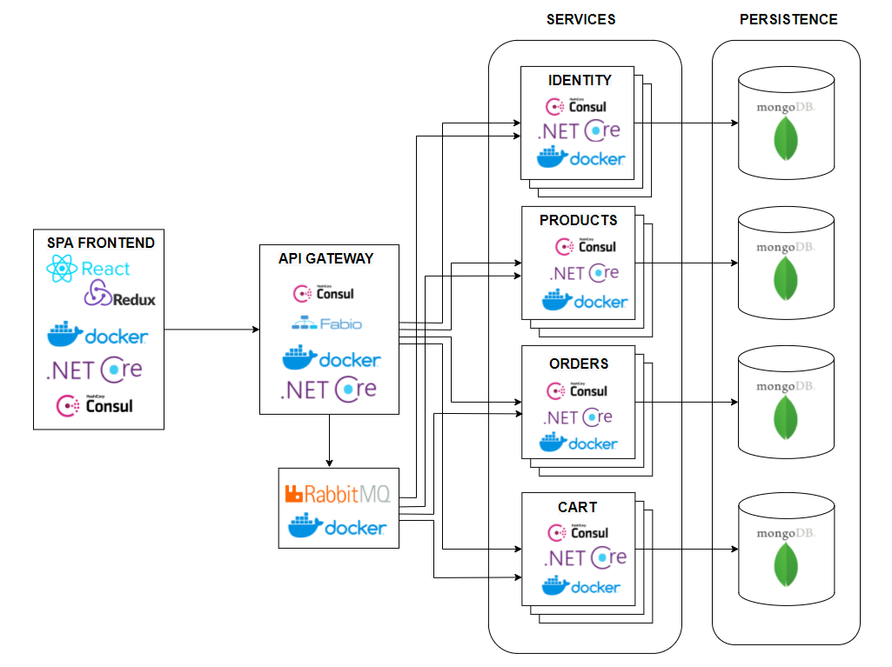
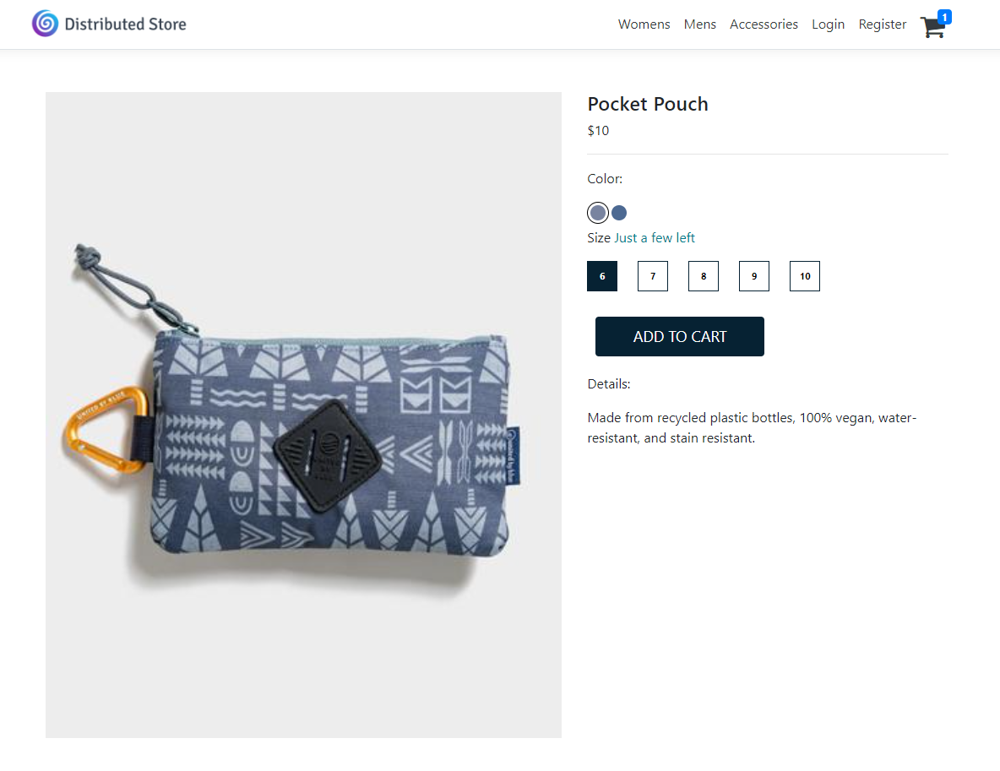
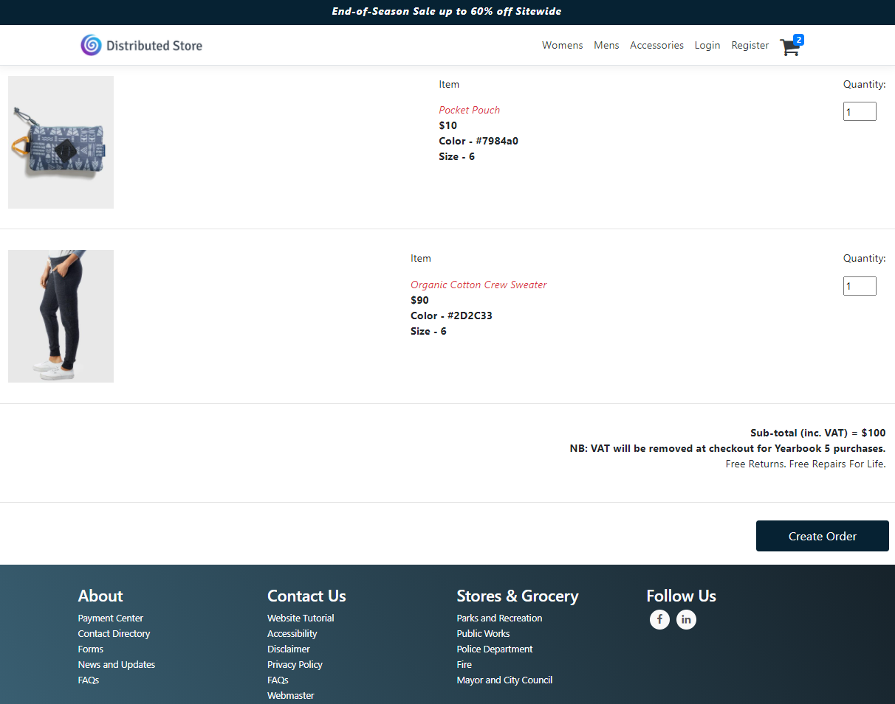

# Distributed-eStore
Containerized .NET Core Online Store application with a microservices architecture and a React and Redux frontend solution.
Technologies used - RabbitMQ, .NET Core, .NET Core MVC, MongoDB, React, Redux, Docker, Consul, Fabio, JWT Authentication, Swagger, Vault.
## Steps to run locally
1. Prerequisites:
* - Docker
* - A running MongoDB service (check connection string in appsettings.json)
2. Run _docker-compose -f ./compose/compose.yml up -d_ from the root directory of the project.
3. Open http://localhost:44310/
## Architecture:

## Demo

### Products

### Product View

### Shopping Cart

Keywords - Docker, Consul, Fabio, RabbitMQ, .Net Core, Mediatr, CQRS, React, Redux. .NET Core Microservices template, .NET RabbitMQ, .NET Core with React and Redux, .NET Distributed, Docker, .NET Core with Docker, .NET Core with Mongo, .NET Core with JWT Auth, React and Redux with JWT.
